# Hi, I'm Johan

  B.Sc. @ BUPT · Computer Vision & Intelligent Sensing · building with taste.

---

- 🔭 I’m currently working on **time-series world models for forecasting** at Siemens DAI R AIX-CN
- 🌱 I’m currently learning **data structures & algorithms** (rebuilding the foundations)
- 👯 I’m looking to collaborate on **quality open-source** — open to serious collaboration of any kind
- 🤔 I’m looking for help with **career path, lifelong growth, and staying healthy** along the way
- 💬 Ask me about **anything**
- 📫 How to reach me:
  [Website](https://johanhuang2005.github.io) ·
  [Email](mailto:johanhuang@bupt.edu.cn) ·
  小红书 `259200943`
- ⚡ Fun fact: **football & tennis** keep me sharp between experiments

---

  
  
  

  
  
  
  

---

### GitHub stats

  
  

  

---

  

